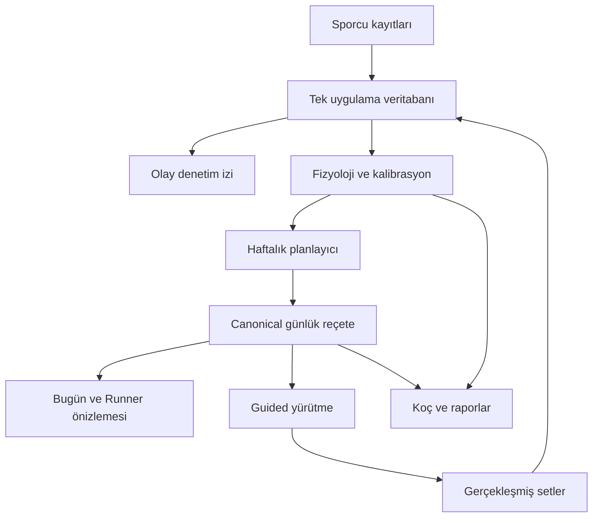

# Athlete Life OS v9.0 — Mimari değişiklik ve doğrulama raporu

## Sonuç ve kapsam

Bu sürüm v8.2 kaynak kodundan oluşturuldu. Kullanıcının tarayıcısındaki canlı sporcu veritabanı bu pakette bulunmadığından, gerçek kişisel kayıtlarla yerinde doğrulama yapılmadı. Değişiklikler veri erişimi, plan kimliği, yürütme, kayıt düzeltmeleri, bağımlılık sırası ve kullanıcı arayüzündeki çelişkili öneri yollarına odaklanır. Mevcut bütün hesaplamaların bilimsel geçerliliği kanıtlanmış değildir.

## Doğrulanan kök nedenler

| Alan | Önceki durum | v9.0 davranışı |
|---|---|---|
| Veritabanı erişimi | `let db` ile saklanan veri birçok modülün `window.db` okumasına açık değildi | Aynı nesneye dönen getter; yedek yüklenince yeni nesneyi de izler |
| Uygulama açılışı | app.js, sonraki motorlar yüklenmeden ilk planı/ekranları oluşturuyordu | Başlangıç DOMContentLoaded sonrasına alındı |
| Gün seçimi | Spor günü ve ayrı gece cutoff ayarı farklı günleri seçebiliyordu | Otomatik hedef tek spor günü kuralını kullanır |
| Başlatıcı | Eski oturuma yönlendirme ve seçili telafi günü, bugünün planının önüne geçiyordu | Bugünün başlatıcıları açıkça bugünü alır; telafi ayrı düğme ve onaydır |
| Runner önizlemesi | Ayrı plan/oturum kopyası | Günlük görünümle aynı reçetenin aynı gösterimi |
| Reçete sözleşmesi | Eşitlik çoğunlukla hareket adlarıyla kontrol ediliyordu | Kimlik, sıra, reçete, yük ve dinlenme hedef/bantları karşılaştırılır |
| Veri kilidi | Eski Runner snapshot'ı başka canonical kaydı ezebiliyordu | Mevcut reçete ezilmez; yürütülmüş çakışma görünür ve yeni set engellenir |
| Analiz kıyası | Plan–gerçekleşen alanı genel şablon okuyordu | Canonical hareketleri ve gerçekleşmiş setleri kullanır |
| Olay deposu | Güncellenen kayıtlar eski kalabiliyor veya ikinci satır oluşabiliyordu | Kalıcı satır kimlikleri, güncelleme ve silme olayları; DB yetkili, olaylar denetim izidir |
| Motor güncellemesi | Bağımsız save/render çağrıları ve kısmi event dinleyicileri | Kaynak değişikliği tespiti ve sıralı koordinatör |
| Kalibrasyon | Yeniden işleme örnek sayısını şişirebiliyordu | Kaynak setlerden tekrar üretim, aynı sonuç ve aynı seans sayısı |
| Doku özeti | Ters tarih sıralamasında en eski altı maruziyet seçilebiliyordu | En yeni altı maruziyet alınır |
| Beslenme | Kalori hedefi ile makro enerjisi farklı olabiliyordu | 4/4/9 hesabı ile uzlaşma, tutarlılık alanı; açık kalori hedefine ikinci surplus eklenmez |
| Başlatma dosyası | Port doluyken eski sürümü tarayıcıda açabiliyordu | Port alınamazsa durur; eski sunucuyu açmaz veya sonlandırmaz |

## Veri akışı

`AthleteCoordinator` kaydetmeden sonra kaynak verinin değişip değişmediğini kontrol eder. Saatin ilerlemesi veya türetilmiş fizyoloji snapshot'larının güncellenmesi kendi başına yeni plan döngüsü başlatmaz. Gün değişimi ayrıca izlenir. Bağımlılık sırası: kayıt projeksiyonu → fizyoloji → kalibrasyon → gelecek plan → canonical reçete → Runner → analiz/görünümler. Aşama hataları durum alanına yansır; aynı verilerle boşuna yeni revizyon oluşturulmaz.

`TrainingSessionService` günlük reçete, hedef güne bağlı gerçekleşmiş satırlar, tam reçete karşılaştırması, veri türü ve güncel sağlık engeli için ortak sözleşmedir. Canonical okumaları kopya döndürür; bir ekranın okuduğu nesneyi değiştirmesi merkezi planı değiştirmez.

Plan tarihi ve gerçek antrenman günü ayrı kalır. Telafi sonuçları açık hedef ve gerçek gün ile finalize edilir; arayüzdeki seçicinin son değerine güvenilmez. Yük hesaplaması gerçekleşmiş verilerden, plan uyumu önerilmiş reçeteden yapılır.

## Arayüz ve oturum davranışı

- Bugünün hazır planının altında doğrudan bu planı çalıştıran düğme bulunur.
- Runner başlatıcı önizlemesi aynı listeyi gösterir; plan kimliği ve tarih görünürdür.
- Geçmiş/telafi seçenekleri ayrı bir açılır bölümdedir. Kayıtlı geçmiş oturum, bugünün önerisi olarak sunulmaz.
- Başlamamış reçete yeni verilerle güncellenebilir. İlk setten sonra kayıt tutarlılığı için korunur.
- Yeni sağlık engeli, kilitli planı geçmişe dönük değiştirmeden yeni seti engeller.
- Süre ilk setle başlar, duraklamada donar ve bitiş anında sabitlenir. Sayfa kapanma olayı alınırsa seans duraklatılarak saklanır.
- Baştan başlatma hiçbir gerçekleşmiş seti silmez. Eski Runner durumu arşivlenir, sayaç sıfırlanır ve ilk eksik sete geçilir. Gerçekten hatalı bir set, kayıt düzenleyicisinden ayrıca düzeltilmelidir.

## İncelenen alt sistemler

- Veri/persistans: app, migration, event store, engine bus, backup vault, record manager.
- Plan/yürütme: app planlayıcısı, canonical session, guided core/engine, adaptive intelligence, adherence, gap reconciliation, substitution ve ad-hoc kayıt yolları.
- Analiz: physiological impact, movement intelligence, pain/health, rest/load prescription, periodic/performance trends, personal calibration, tissue load, athlete profile.
- Beslenme: food/water ledger, hydration, nutrition impact, adaptive nutrition ve UI köprüsü.
- Görünüm/başlangıç: index, styles, script sırası, architecture bootstrap, release kontrolleri, service worker, Mac/Windows başlatıcıları.

Bağımsız `AdaptiveCoachSolver` kaldırılmadı; deneysel alternatif senaryo olarak açıkça etiketlendi ve aktif antrenman otoritesi olmaktan ayrıldı. Mevcut haftalık planlayıcı ve sağlık/hacim uyarlaması günlük reçetenin üreticisidir. Bu ayrım, iki ayrı optimizasyon motorunun iki ayrı aktif program önerdiği izlenimini kaldırır.

## Testler

- 24 JavaScript test dosyası başarıyla çalıştı; tüm JavaScript dosyaları syntax kontrolünden geçti.
- `integration-v9.test.js`, gerçek scriptleri index sırasıyla Node VM içinde yükler; yalnız DOM, zamanlayıcı ve tarayıcı çevresi taklit edilir. Planlayıcı, Runner, kayıt, fizyoloji, kalibrasyon ve koordinatör gerçek uygulama kodudur.
- Entegrasyon kapsamı: lexical/global DB köprüsü, yedek sonrası nesne değişimi, telafi seçiliyken bugünü başlatma, günlük/Runner HTML eşitliği, dinlenme değişiminde eşitleme, immutable okuma, ilk set kilidi, yeni sağlık engeli, veri silmeyen restart, fizyolojiye kayıt ulaşması, olay güncelleme/silme/geri yükleme, deterministik kalibrasyon, sıralı yeniden hesaplama ve makro enerji tutarlılığı.
- Python başlatıcı testleri: port meşgulken tarayıcının açılmaması ve başarı halinde aynı origin'in kullanılması.
- HTML'de yinelenen ID yok; script dosyaları mevcut.
- Gerçek Chromium/Safari görsel testi yapılamadı: bu ortamda tarayıcı ikilisi bulunmuyor. Node VM testi gerçek tarayıcı testi değildir.

## Sınırlar ve sonraki mühendislik işleri

- Bu sürüm bir klinik sporcu değerlendirme aracı veya doğrulanmış kişiye özel antrenör modeli değildir. Mevcut birçok skor/eşik sezgiseldir. Bilimsel yayınlar, bu uygulamanın özel skorlarının doğruluğunu tek başına kanıtlamaz.
- Eksik beslenme günleri, kısa dönem su ağırlığı, özbildirim hataları ve standardize edilmemiş hareket varyasyonları analizleri etkileyebilir. Eksik hazır oluş bilgisi sıfır gibi gösterilmez.
- Tüm eski modüller saf fonksiyonlara veya tek atomik command store'a taşınmış değildir. Koordinatör, mevcut uygulama üzerinde ortak güncelleme sınırıdır; tam yeniden yazım iddiası değildir.
- Tek tarayıcı/origin üzerinde çalışır. Çok cihaz/çok sekme eşzamanlı yazma çatışmalarını çözen sunucu veritabanı veya hesap senkronizasyonu kurulmadı.
- Eski günlük `sessionFeedback` yapısı bir gerçek gün için tek ana özet tutar; aynı gün çoklu bağımsız seansın tam normalizasyonu ayrı geçiş gerektirir. Setler ve planHistory/Guided arşivleri korunur, ancak tüm eski günlük raporların çoklu seans semantiği tamamlanmış değildir.
- Canlı kullanıcı yedeği ile kabul testi ve gerçek Safari/telefon testi yapılmadan üretim doğrulaması tamamlanmış sayılmamalıdır.

## Geçiş / kabul kontrolü

1. Eski sürümden Data Vault yedeğini dışa aktar; tarayıcı verilerini temizleme.
2. Eski uygulamanın Terminal sunucusunu durdur. Yeni klasörde START_MAC.command veya START_WINDOWS.bat çalıştır.
3. Aynı tarayıcı ve `http://127.0.0.1:8765` adresini kullan. Üstte v9.0 göründüğünü kontrol et.
4. Bugünün planı ve Runner önizlemesinin tarih, plan kimliği, hareket, reçete ve yüklerini karşılaştır.
5. Hiç set başlamamışken süre 00:00 olmalı. Bir set başlat/duraklat; ardından hatalı bir kayıt düzeltip veri revizyonunu kontrol et.
6. Telafi seçicisinde farklı tarih seçiliyken bugünün ana başlatıcısını kullan: bugünün planı açılmalıdır. Telafi yalnız kendi düğmesiyle açılır.
7. Baştan başlatmadan önceki setlerin kayıt listesinde hâlâ bulunduğunu kontrol et.
