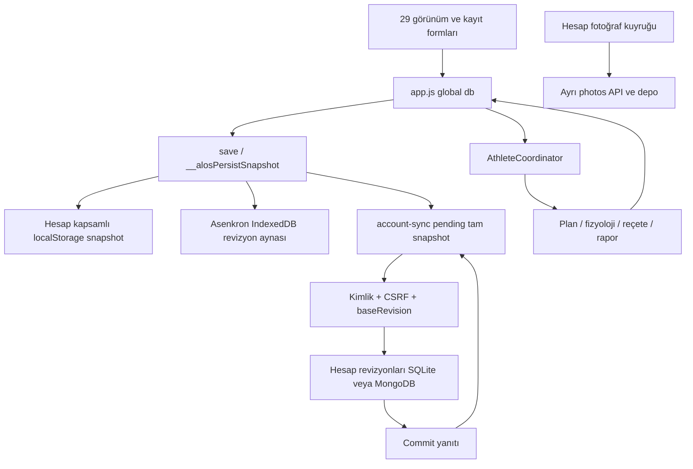

# Mevcut sistem haritası — Aşama 0

Kaynak: `e92b4b736e9f4aa8bcd64103ec59b1aa6abf5297`; çalışma dalı `codex/alos-2-stage-0`. 16 Eylül 2026 şartnamesi esas alındı. Bu rapor çalışan yerel kaynak kodunu denetler; Render/Atlas konfigürasyonu bu aşamada okunmadı veya değiştirilmedi. 2.0 henüz uygulanmadı.

## İnceleme kapsamı

282 izlenen dosya, 133 kök kaynak modülü, 75 mevcut test giriş dosyası. Tam dosya ağacı, SHA-256, global API'ler ve durum referansları: [üretilen kaynak dizini](../evidence/stage-0/inventory/SOURCE_INDEX.md) ve [makine dizini](../evidence/stage-0/inventory/source-index.json). Regex çıktısı dinamik çağrı çözümleyicisi değildir; `d` bazen DOM elemanı/SQL bağlantısıdır. Aşağıdaki akışlar ayrıca elle incelendi ve belirtilenleri çalıştırıldı. Gizli/ignored veriler taranmadı; medya gövdeleri örnek veri yapılmadı.

## İki farklı giriş yolu

| Yol | Kaynak dayanağı | Davranış / doğrulama |
|---|---|---|
| Hesaplı sunucu, Render giriş noktası | `start_render.py:7 render_arguments`, `account_server.py:325 main` | HTTPS origin + Mongo state/account ayarını zorunlu kılar; Python ThreadingHTTPServer. `render-start.test.py` PASS. Bu kaynak seçimi canlı deploy kontrolü değildir. |
| Hesaplı yerel başlatıcı | `start_local.py`, `START_LOCAL_MAC.command`, `account_server.py:308 make_server` | SQLite veya açık Mongo seçimi; izole sentetik SQLite ile HTTP/tarayıcı denendi. |
| Eski tek kullanıcı | `launch.py:36 commit_state`, `sqlite_store.py:77 commit_state`, `mongo_store.py` | `/api/state` tam snapshot, kullanıcı sahipliği yok; loopback. Eski veri ezilmesi burada yeniden üretildi. Canlı hesaplı yolun açığı diye genellenemez. |
| Dosyadan index | `index.html:1874` | `server-sync.js` yükler; HTTP hesap enjeksiyonu yok. Hesaplı sunucunun sunduğu HTML ile aynı değildir. |

`account_server.py:140` HTML'i dönüştürür: hesap bağlamı, tema ve yeni modülleri ekler; `server-sync.js` yerine `account-sync.js` koyar. Bu yüzden yalnız index script listesini saymak güncel ürünü eksik haritalar.

## Kalıcılık ve açılış kararı

1. `account-context.js:6` hesap ID'siyle localStorage/sessionStorage/IndexedDB adlarını ayırır. Eski oturum başka hesaba döndüğünde kilitlenir. `account-context.test.js` PASS; tüm tarayıcı auth senaryoları PASS değildir.
2. `account-sync.js:29 bootstrap` senkron GET yapar. Pending varsa yerel taslağı benimser; remote revizyon farklıysa görünür çatışma. Pending yoksa remote state yerel RAW'ı değiştirir. 500/503 cache'i korur, 401/403 kilitler. Ancak HTTP 200 `{}` de yeni boş profil gibi kabul edilir; schema doğrulaması eksik. [VM kanıtı](../evidence/stage-0/probes/client.stdout.json).
3. `durable-persistence.js:21 bootstrap` RAW/checksum veya tek rollback kopyasını seçer. `save:26` localStorage okuma sonrası doğrular; IndexedDB aynası sırayla ama ayrı transaction'da yazılır. Hesap outbox yazımı ve yerel görünüm atomik değil. `recoverIfNewer:43`/`backup-vault.js:307` geri kazanım ayrı revision/weight kararları içerir; server otoritesi yerine kullanılamaz.
4. `account-sync.js:50 flush` pending'i ACK'e kadar tutar, istekleri sıraya koyar. Eski yanıt daha yeni pending'i silmez. 409 bütün hesabın yazımını durdurur; yerel JSON indirilmeden remote açma aktif olmaz (`showConflict:70`). Entity merge/idempotency/cursor pull yok. Başka cihazın verisini görmek için yeni açılış gerekiyor; açık iki ekranın otomatik yakınsaması kanıtlanmadı.
5. `account_states.py:65/113 commit_state` tam snapshot base_revision kontrol eder; SQLite BEGIN IMMEDIATE, Mongo unique `(user_id, revision)` + majority. Aynı request kayıp ACK sonrası önceki sonucu tekrar vermez, 409 olur. Mongo adaptörü mongomock ile denendi; Atlas transaction/durability testi değil.
6. `app.js:308 persistWeeklyScheduleFromUI` tüm 7 satırı toplar. `:326` mesajı local snapshot sonrası çıkar; sunucu ACK'i beklemez. İzole tarayıcıda pending=true iken “Vardiya planı kaydedildi” görüldü. Sağlık kaydı `app.js:222` ayrı flush bekler; tüm form mesajları eşdeğer garanti sunmuyor.

## HTTP uçları — hesaplı yol

Kaynak: `account_server.py:107 get`, `:167 do_POST`. GET/HEAD statik kaynak, Host doğrulaması ve no-store; API anonim erişim 401. Yetkili API GET'lerinde `X-ALOS-Account`, yazımlarda ayrıca Origin ve CSRF gerekir. Kaynak sahibi istemci gövdesinden seçilmez.

| Yöntem / yol | İşlev | Kalıcılık |
|---|---|---|
| POST `/api/auth/signup`, `/login`, `/recover` | Kayıt, giriş, kurtarma; throttle | SQLite Accounts veya MongoAccounts |
| GET `/api/auth/session` | Aktif kullanıcı ve CSRF | Session deposu |
| POST `/api/auth/profile`, `/password`, `/recovery-codes`, `/logout` | Profil, parola, kodlar, iptal | Hesap deposu; profil version |
| GET `/api/state`, `/api/revisions`, `/api/health` | Güncel kendi snapshot'ı / son 50 revizyon / DB okuma | AccountStates |
| POST `/api/state`, `/api/state/beacon` | Tam hesap snapshot commit | Son 250 revizyon; entity API yok |
| POST `/api/restore/{revision}` | Kendi eski revizyonundan yeni commit | Aynı revision deposu; bağımsız backup değil |
| GET `/api/photos`, `/api/photos/{id}`; POST `/api/photos` | Hesaba özel fotoğraf, version, tombstone | Ayrı SQLite/Mongo fotoğraf depoları |
| POST `/api/health/report/preview`, `/pdf` | Kan/uyku raporu, revision kontrolü | Salt okuma; Python PDF |
| POST `/api/activity/report/preview`, `/pdf` | Güncel/arşiv genel rapor | Salt okuma; Python PDF |
| GET `/account-bootstrap.js`, `/index.html` | Yetkili dinamik konfigürasyon/HTML | no-store, allowlist |

API şema/version/OpenAPI ve domain seviyesinde doğrulama yok. `/api/health` readiness'e yakın authenticated okuma; ayrı public liveness/readiness yok. Public signup açık. `accounts.py` scrypt, sunucu session/CSRF, parola sonrası iptal içerir. S-01 tüm uçlar/medya/cursor kapsamı bütünüyle doğrulanmış sayılmaz.

## Domain motorları ve yazıcılar

| Sınır | Gerçek uygulama / kaynak konumu | Girdiler → çıktılar; yazıcı |
|---|---|---|
| Ana kayıt | `app.js:66 db`, `:88 save`, `:96 __alosAutosaveIfDirty` | Çeşitli formlar doğrudan db değiştirir; 2 sn dirty guard da snapshot yazar. |
| Koordinatör | `athlete-coordinator.js:7 inputs`, `:19 flush` | Measured-records → physiology → shared-sport-analysis → calibration → future-plan → canonical → runner → analysis → view zinciri. 5 dk clock bucket, 30 sn kontrol. Sonunda save çağrısı; render salt okuma varsayılmaz. |
| Program | `app.js` içindeki `AthleteProgramEngine`, `training-periods.js:45 plan/:55 progress`, `adaptive-coach-solver.js` | Eski dönem/şablon + günlük durum → futurePlans/generatedWeekPlan/programEngine; mevcut kullanıcı programı yeni şablonla ezilmemeli. |
| Canonical Runner | `canonical-session-engine.js:62 lock/:76 get`, `training-session-service.js:6 prescription`, `guided-workout-engine.js:329 startWorkout/:367 startSet` | Gün anahtarlı sessionPrescriptions; aktif guided → trainingLogs, guided history, feedback. İlk set kilidi yalnız istemci işlemi; DB transaction değil. |
| Yeni dönem/Runner | `training-planner-core.js:121 startRun/:130 updateRun/:135 finishRun`, `workout-program-core.js`, `athlete-workspace-core.js` | multisportPeriods → activeWorkoutRun → sportSessions/workoutRunHistory + projected trainingLogs. Legacy guided ile iki ayrı execution modeli var. |
| Zaman/vardiya | `app.js:112 todayKey/:115 trainingViewDate/:296 weekPlannerDate/:354 initWeek/:365 optimizeWeek/:2749 initTrainingDateNavigation` | selectedDate/uiState, scheduleByDate, week, weekOptimizations. Midnight callback geçmiş seçimi zorla bugüne değiştiriyor; saat dilimi cihaz yereline bağlı. |
| Beslenme/su | `nutrition-ledger-engine.js`, `nutrition-record-engine.js`, `water-ledger-engine.js`, `hydration-intelligence-engine.js`, `adaptive-nutrition-engine.js`, `account-personal-model.js` | Öğün snapshot/ledger; water + waterLogs birlikte; targets ve model tahmini ayrı. Ayrıntılı normalization kaynak dizininde. |
| Sağlık | `personal-health-core.js:18`, `health-core.js:19 validate/:56 saveReport/:78 saveSleep`, `health-state-engine.js`, `pain-intelligence-core.js` | personalHealthProfile/cycleDays/healthEpisodes/healthAdjustments; daily sleep/health; healthLabRecords/history; rapor Python. |
| Toparlanma/yük | `app.js:1782 recoveryReferenceTime/:1818 muscleRecoveryLedger/:1832 muscleRecoveryDetail`, `physiological-impact-engine.js`, `tissue-load-engine.js`, `sports-science-policy.js` | trainingLogs, RIR, zaman, bağlam → decay/load/readiness/ETA. Zaman ilerlemesi testleri PASS; biyolojik doğruluk veya geçmiş karar lineage doğrulanmadı. |
| Yetkinlik/trend | `athlete-profile-engine.js`, `capability-catalog.js`, `periodic-trend-engine.js`, `performance-trend-v2.js`, `personal-calibration-engine.js` | capabilityRecords + body/training → trend, PR, skor, calibration. Birim/protokol hedef schema gerektirir. |
| Yerel event sistemi | `event-store-engine.js:5/23/90`, `architecture-bootstrap.js:41 modelSnapshot`, `data-lineage-engine.js` | localStorage event/tombstone ve derived snapshots; sunucuda transactional event log değil. |
| Kayıt yönetimi | `record-manager.js:68`, `workspace-lifecycle-core.js`, `workspace-lifecycle-ui.js` | Edit/delete/undo, removedSportSessions, generation reset ve arşiv. Her normal kayıt gibi global snapshot üzerinden. |
| Yedek | `backup-vault.js:103 exportBackup/:147 mergeDB/:269 applyImport` | data/events/photos ayrı kaynaklardan; async fotoğraf okuması, checksum; atomic server backup veya outbox export değil. |
| Bütünlük testi | `system-integrity-engine.js:28 run/:272 finally` | Global db'yi sandboxBase ile değiştirip geri koyuyor. Sentetik deneyde transport push'a 4 sandbox save ulaştı; bu girişler testte tutuldu, sunucuya gönderilmedi. |

Geniş API/fonksiyon bağımlılıkları kaynak dizinindedir. “Motorlar tek merkezden çağrılıyor” demek tek transaction, tek gerçek set kaynağı veya tüm girdilerin lineage'ı var demek değildir.

## Ekranlar ve medya

`account-workspace.js:9 groups` yedi ana grup tanımlar; dinamik toplam 29 sayfa, public login/signup/recovery, form modal'ları, header araçları bulunur. Tam ekran/alt özellik tablosu [FEATURE_PARITY](../../FEATURE_PARITY.md). 29 route yerel gerçek sunucuyla açıldı, anonim referans PNG alındı; tam viewport/cross-browser parity iddiası değil.

`bodymap3d.js` bundled GLB ve kullanıcı yükleme yolu içerir; `account_server.py:162` izin verilen assets uzantılarını authenticated kullanıcılara sunar. Kişisel bir GLB'nin bütün hesaplara ortak asset olması mahremiyet/lisans incelemesi gerektirir. Bu aşamada model yüklenmedi veya kopyalanmadı; anonim ekranlarda GLB request engellendi. Account photo API ayrı sahiplik uygular.

## Service worker ve offline sınırı

- Diskteki `service-worker.js:7` artık `/api/` isteklerini cache dışı bırakır; eski audit'in “tüm GET” bulgusu güncel kaynağa aynen uygulanamaz.
- Hesaplı sunucu `account_server.py:153` fetch handler olmayan, cache'leri silen replacement worker döndürür. Bu mahremiyet önlemi hesabın app-shell'ini çevrimdışı yeniden açabilmesini sağlamaz.
- Zaten açık sekmede local pending bulunması, tamamen kapalı tarayıcıda offline launch/login ile aynı garanti değildir. Service worker upgrade/in-flight queue, Safari ve gerçek iPhone NOT RUN.

## Geçiş kararı

Bu kod tabanı değerli kayıt/katalog/akış bilgisi sağlar. Yeni çekirdeği mevcut global JSON modelini yeniden adlandırarak kurmak kabul edilmedi. [ADR dizini](../adr/0001-modular-monolith.md) ve [Aşama 1 dosya/test planı](../../PLANS.md) authoritative PostgreSQL komut modeli, küçük vardiya dikey dilimi ve kontrollü taşıma tanımlar. Üretim verisi bu aşamada taşınmadı.
